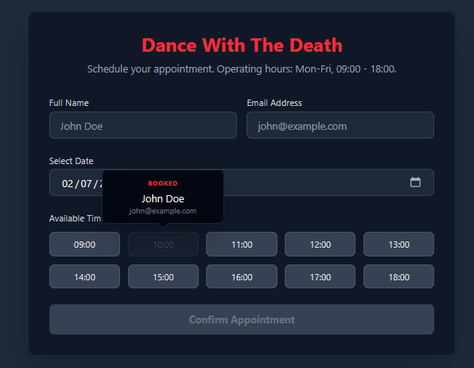

# Dance With The Death - Frontend (UI)

This is the Vue frontend for the Dance With The Death (DWTD) application. It consumes the DWTD Laravel backend to allow users to schedule their appointments with the Death.

## Prerequisites

Before you begin, ensure you have the following installed on your machine:
* **Node.js:** Version 20.x or higher.
* **Git:** Version control system.
* **Backend Running:** Ensure the DWTD Laravel backend is actively running.

## Installation & Local Setup

### 1. Clone the repository
```bash
git clone <dwtd-repository-url>
cd DWTD-frontend
```

### 2. Install dependencies
```bash
npm install
```

### 3. Environment Configuration
You need to point the Vue app to the local Laravel API. Create a .env file in the root of the project.

For Mac and Linux:
```bash
touch .env
```

For Windows:
```bash
echo. > .env
```

Open the .env file and add the following variable. Ensure the port matches your Laravel backend (default is 8000):

```bash
VITE_API_URL=http://localhost:8000/api/v1
```

4. Start the Local Development Server
```bash
npm run dev
```

The application will be available at ```http://localhost:5173``` Open this URL in your browser to view the app.


## Application UI

